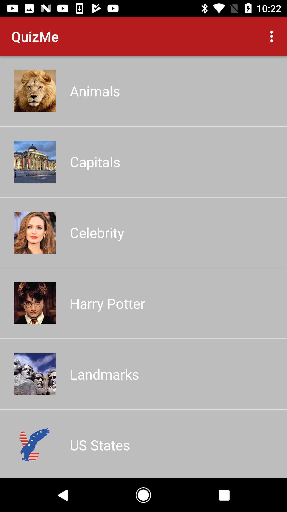
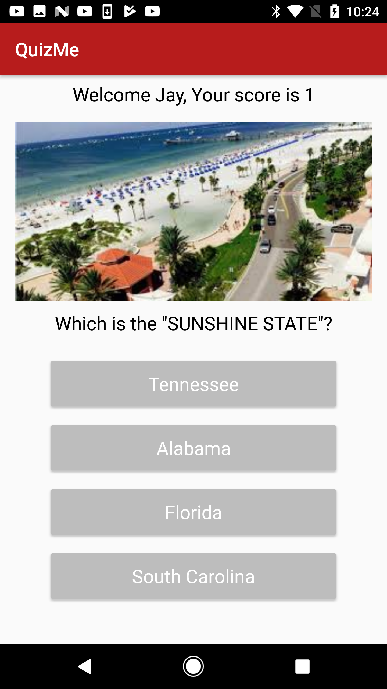

# QuizMe
QuizMe is an fun Android quiz app developed by the CodeWithJay foundation.

# Functionalities

## User
For the user, QuizMe is a fun app, which lets you play new quizzes on the go. New quizzes are added every week. Each quiz consists of multiple questions with varying levels of difficulty. Questions include images to increase visual appeal, and also include multiple choices.

## Quiz Master
For the quiz master, QuizMe is a flexible app, where new quizzes can be added in a matter of minutes. Adding new quizzes consists of simply adding new rows to the quiz spreadsheet, and uploading the corresponding images to Firebase storage.

# App Screenshots
  

# Languages and Libraries Used
Android, Java, Firebase, Glide.

# Support

If you've found a bug using this app, or want to provide your feedback, please email codewithjay@gmail.com. Patches are strongly encouraged, and may be submitted by forking this app and submitting a pull request through GitHub.

# License

Copyright 2017 Code With Jay, Inc.

Licensed to the Apache Software Foundation (ASF) under one or more contributor license agreements. See the NOTICE file distributed with this work for additional information regarding copyright ownership. The ASF licenses this file to you under the Apache License, Version 2.0 (the "License"); you may not use this file except in compliance with the License. You may obtain a copy of the License at

http://www.apache.org/licenses/LICENSE-2.0

Unless required by applicable law or agreed to in writing, software distributed under the License is distributed on an "AS IS" BASIS, WITHOUT WARRANTIES OR CONDITIONS OF ANY KIND, either express or implied. See the License for the specific language governing permissions and limitations under the License.